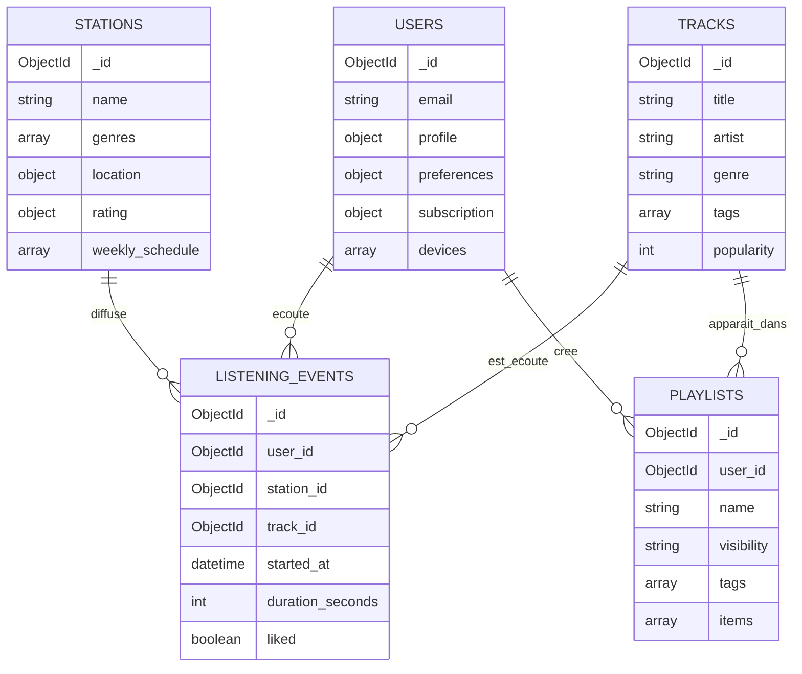

# Projet NoSQL - RadioStream Analytics

## 1. Sujet choisi

RadioStream Analytics est une application de radio en ligne. Elle permet de cataloguer des stations, des titres, des utilisateurs, des ecoutes et des playlists. L'objectif metier est d'aider une plateforme audio a comprendre son audience, recommander des contenus et exposer des indicateurs utiles aux equipes produit, marketing et programmation.

## 2. Pourquoi NoSQL plutot que SQL

MongoDB est adapte car les donnees sont heterogenes et evolutives:

- une station contient des genres, une localisation GeoJSON, une note et une grille de programmes imbriquee;
- un utilisateur contient un profil, des preferences, un abonnement et plusieurs appareils;
- une ecoute est un evenement volumineux, horodate, facilement agrege par periode, station ou ville;
- les playlists contiennent une liste variable de titres et des tags;
- les besoins de recommandation changent souvent et beneficient de documents flexibles.

Un modele SQL traditionnel obligerait a multiplier les tables de jointure pour les genres, appareils, horaires, tags et elements de playlists. MongoDB permet de garder ensemble les informations souvent lues ensemble, tout en conservant des references entre collections pour les donnees partagees.

## 3. Documents MongoDB

Le projet utilise 5 collections principales.

### stations

Document station radio.

```json
{
  "_id": "ObjectId",
  "name": "Jazz Horizon",
  "country": "France",
  "city": "Paris",
  "genres": ["jazz", "soul", "blues"],
  "language": "fr",
  "bitrate_kbps": 192,
  "location": { "type": "Point", "coordinates": [2.3522, 48.8566] },
  "rating": { "average": 4.7, "count": 428 },
  "weekly_schedule": [
    { "day": "monday", "start": "08:00", "end": "11:00", "program": "Morning Jazz", "host": "Nora" }
  ]
}
```

### tracks

Catalogue des titres, emissions courtes ou contenus audio.

```json
{
  "_id": "ObjectId",
  "title": "Blue River",
  "artist": "Nora Miles",
  "genre": "jazz",
  "duration_seconds": 241,
  "tags": ["saxophone", "night"],
  "popularity": 92
}
```

### users

Profil auditeur.

```json
{
  "_id": "ObjectId",
  "email": "alice@example.com",
  "display_name": "Alice",
  "profile": { "age_group": "18-25", "country": "France", "city": "Paris" },
  "preferences": { "favorite_genres": ["jazz", "lofi"], "languages": ["fr", "en"] },
  "subscription": { "plan": "premium", "started_at": "datetime" },
  "devices": [{ "type": "mobile", "os": "iOS" }]
}
```

### listening_events

Evenements d'ecoute.

```json
{
  "_id": "ObjectId",
  "user_id": "ObjectId",
  "station_id": "ObjectId",
  "track_id": "ObjectId",
  "started_at": "datetime",
  "duration_seconds": 235,
  "device": "mobile",
  "location": { "city": "Paris", "country": "France" },
  "liked": true
}
```

### playlists

Playlists creees par les utilisateurs.

```json
{
  "_id": "ObjectId",
  "user_id": "ObjectId",
  "name": "Jazz pour coder",
  "visibility": "private",
  "tags": ["focus", "jazz"],
  "items": [{ "track_id": "ObjectId", "added_at": "datetime" }]
}
```

## 4. Diagramme entite-association documentaire



## 5. Besoins utilisateurs

1. En tant qu'auditeur, je veux trouver rapidement des stations correspondant a mes genres preferes.
2. En tant qu'auditeur, je veux decouvrir des stations proches de ma localisation.
3. En tant qu'auditeur, je veux recevoir des recommandations basees sur mes ecoutes.
4. En tant qu'auditeur, je veux consulter mon historique d'ecoute enrichi.
5. En tant que programmateur, je veux connaitre les heures de pic d'une station.
6. En tant que programmateur, je veux savoir quels programmes sont diffuses a un horaire donne.
7. En tant qu'equipe produit, je veux identifier les stations les plus ecoutees.
8. En tant qu'equipe produit, je veux mesurer la retention moyenne des titres.
9. En tant qu'equipe marketing, je veux connaitre les villes les plus actives.
10. En tant qu'equipe marketing, je veux segmenter les utilisateurs par abonnement, age et genre prefere.
11. En tant que responsable editorial, je veux connaitre les titres les plus aimes par genre.
12. En tant que responsable communaute, je veux analyser les tendances des playlists publiques.

## 6. Requetes preparees

| ID API | Besoin couvert | Description |
| --- | --- | --- |
| `stations_by_genre` | 1 | Recherche de stations par genre et pays. |
| `nearby_stations` | 2 | Recherche geospatiale de stations proches. |
| `personalized_recommendations` | 3 | Recommandations selon preferences et historique. |
| `user_history` | 4 | Historique d'ecoute enrichi avec station et titre. |
| `peak_hours` | 5 | Agregation des durees d'ecoute par heure. |
| `programs_on_air` | 6 | Filtre sur la grille de programmes imbriquee. |
| `top_stations` | 7 | Classement des stations par minutes d'ecoute. |
| `track_retention` | 8 | Taux moyen de completion par titre. |
| `audience_by_city` | 9 | Audience active par ville et pays. |
| `subscription_segments` | 10 | Segmentation par abonnement, age et genre prefere. |
| `liked_tracks_by_genre` | 11 | Titres les plus aimes par genre. |
| `playlist_tags` | 12 | Tags les plus utilises dans les playlists publiques. |

## 7. API et interface

L'API Flask expose toutes les requetes via:

```text
GET /api/queries
GET /api/queries/<query_id>
```

Exemples:

```text
GET /api/queries/stations_by_genre?genre=jazz&country=France
GET /api/queries/top_stations?days=14&limit=5
GET /api/queries/personalized_recommendations?email=alice@example.com
GET /api/queries/nearby_stations?lat=48.8566&lng=2.3522&max_km=900
```

La page web racine `http://localhost:5000` liste les requetes, genere les champs de parametres et affiche les resultats JSON.

## 8. Remplissage de la base

Le script `src/seed.py` cree:

- 6 stations;
- 12 titres;
- 6 utilisateurs;
- plusieurs evenements d'ecoute recents et historiques;
- 5 playlists.

Le chargement peut etre lance avec:

```powershell
python -m src.seed
```

Avec Docker, le chargement est automatique au demarrage de l'application.

## 9. Index MongoDB

Le projet cree les index suivants:

- `users.email` unique;
- `stations.genres`;
- `stations.location` en `2dsphere`;
- `tracks.title`, `tracks.artist`, `tracks.tags` en index texte;
- `listening_events.started_at`;
- `listening_events.station_id + started_at`;
- `listening_events.user_id + started_at`;
- `playlists.user_id`;
- `playlists.tags`.

Ces index soutiennent les recherches par profil, les aggregations temporelles, les recommandations et la recherche geospatiale.
